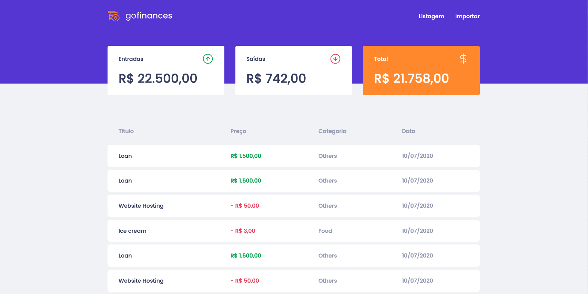
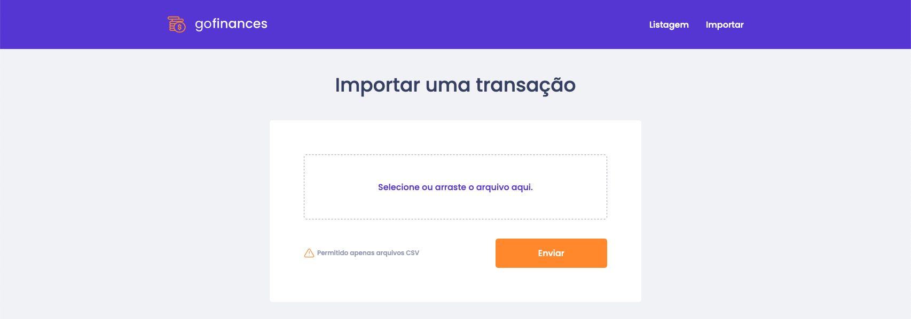

<h3 align="center">
  Desafio 07: GoFinances Web
</h3>

<blockquote align="center">“Não espere resultados brilhantes se suas metas não forem claras”!</blockquote>

<p align="center">
  

  <a href="https://valdirmendes.dev">
    
  </a>

  

  <a href="https://github.com/valdirmendesdev/gostack-fundamentos-reactjs/stargazers">
    
  </a>
</p>

<p align="center">
  <a href="#rocket-sobre-o-desafio">Sobre o desafio</a>&nbsp;&nbsp;&nbsp;|&nbsp;&nbsp;&nbsp;
  <a href="#memo-licença">Licença</a>
</p>

## :rocket: Sobre o desafio

Vamos para mais um desafio do bootcamp da Rocketseat.

Nesse desafio, foi proposto o desenvolvimento de uma aplicação de gestão de transações, a GoFinances. O requisito é usar o React.js junto com TypeScript, utilizando rotas e envio de arquivo CSV por formulário.


### :lock: Dependências da aplicação

Essa aplicação irá consumir o backend que foi desenvolvido no [Desafio 06](https://github.com/valdirmendesdev/gostack-database-upload), para exibir as transações criadas e permitir a importação de um arquivo CSV para gerar novos registros no banco de dados.

Para esta aplicação funcionar é necessário baixar e rodar a aplicação contida neste repositório.

### Layout da aplicação

<p align="center">


</p>

### Funcionalidades da aplicação

Segue abaixo as funcionalidades da aplicação:

- **`Listagem + Dashboard`**: Na página `Listagem` é possível visualizar um quadro com o total de entradas, o total de saídas e o resultado de **entradas - saídas**. Também é possível ver a listagem das transações organizadas com as colunas `título`, `preço`, `categoria` e `data`.

- **`Importação de transações`**: Na página `Import`, permite o envio de um arquivo no formato `csv` para o seu backend, que irá fazer a importação das transações para o seu banco de dados. O arquivo csv deve seguir o seguinte [modelo](https://github.com/Rocketseat/bootcamp-gostack-desafios/blob/master/desafio-database-upload/assets/file.csv).

### :running: Rodando a aplicação

Para executar a aplicação, clone este repositório, entre na pasta do projeto e instale as dependências com o seguinte comando no terminal:

```bash
yarn
```

Para rodar a aplicação, execute o seguinte comando no terminal:

```bash
yarn start
```

Para rodar os testes automatizados, execute o seguinte comando no terminal:

```bash
yarn test
```

Acesse o endereço: [http://localhost:3000/](http://localhost:3000/)

## :memo: Licença

Esse projeto está sob a licença MIT. Veja o arquivo [LICENSE](LICENSE) para mais detalhes.
